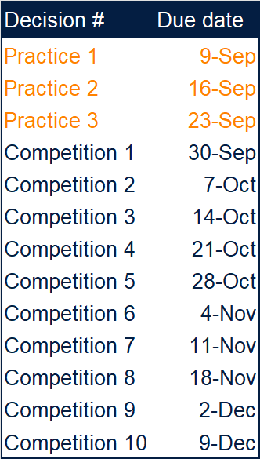

---

## Decision form

Download the submission form. Input your decision for each period and upload in Canvas (one form per team).

[Download submission form](Submission%20form.xlsx)

---

## Schedule

Submission deadlines are at 4pm.

---

## Period 0

Market analysts expect the following market conditions in the next period

* Resource cost will remain at $1 per unit
* Energy cost will remain at $0.5 per unit
* GDP will grow 1.2%
* Tax rate will remain at 35%
* Market wage for admnistrative position will remain at $1000
* Market wage for sales staff will remain at $750 with a 2.5% comission on sales
* Market wage for manufacturers will remain at $500  

[Download period 0](Period%200.xlsx)

---

## Period 1

Market analysts expect the following market conditions in the next period

* Resource cost will remain at $1 per unit
* Energy cost will remain at $0.5 per unit
* GDP will grow 1.8%
* Tax rate will remain at 35%
* Market wage for admnistrative position will remain at $1000
* Market wage for sales staff will remain at $750 with a 2.5% comission on sales
* Market wage for manufacturers will remain at $500  

[Download period 1](Period%201.xlsx)